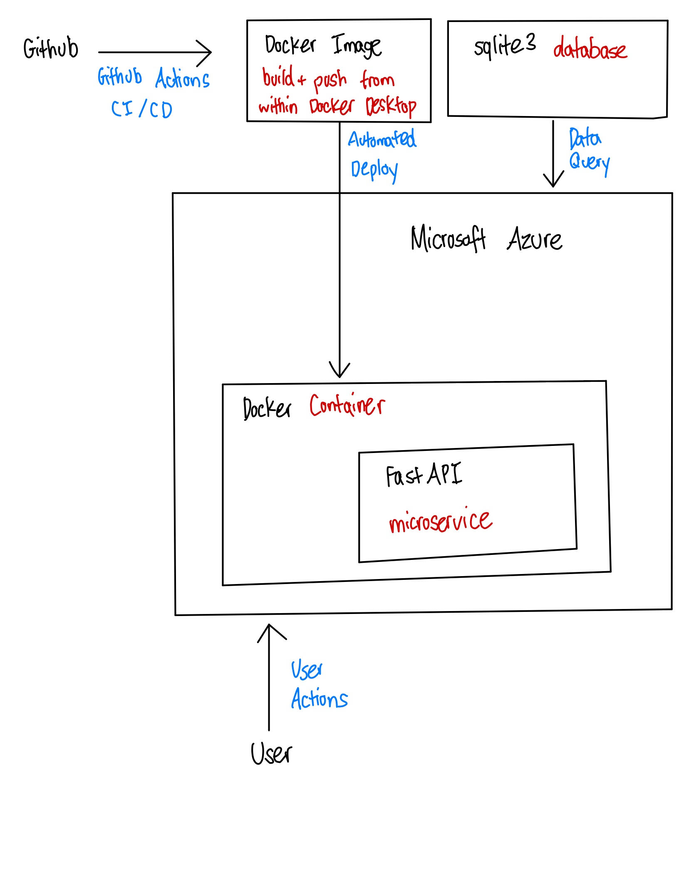
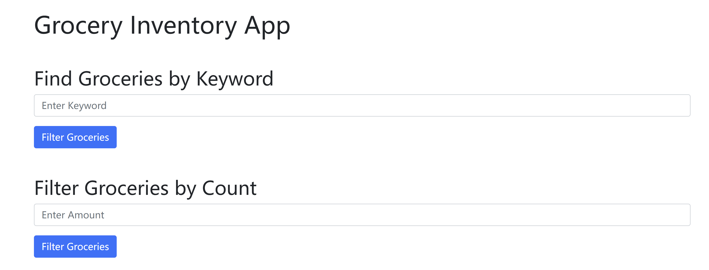

[](https://github.com/nogibjj/Tao_Li_Final_Project/actions/workflows/format.yml)
[](https://github.com/nogibjj/Tao_Li_Final_Project/actions/workflows/install.yml)
[](https://github.com/nogibjj/Tao_Li_Final_Project/actions/workflows/lint.yml)
[](https://github.com/nogibjj/Tao_Li_Final_Project/actions/workflows/test.yml)

# IDS 706 Final Project (Yue Li, Derek Tao)

This repository includes the main tasks for our final project:
* `Makefile` is a configuration file used in Unix-based systems for automating tasks and building software. It contains instructions and dependencies for compiling code, running tests, and other development tasks.
* `.devcontainer` includes a Dockerfile and `devcontainer.json`. The `Dockerfile` within this folder specifies how the container should be built, and other settings in this directory may control development environment configurations.
* `Workflows` includes GitHub Actions, which contain configuration files for setting up automated build, test, and deployment pipelines for your project.
* `.gitignore` is used to specify which files or directories should be excluded from version control when using Git.
* `README.md` is the instruction file for the readers.
* `app.py` is a Flask app that can be deployed on Azure App.
* `Dockerfile` defines the process of the Docker container.
* `test_main.py` contains the tests so that the Flask app runs under several test cases.
* `requirements.txt` is to specify the dependencies (libraries and packages) required to run the project.

## Project Requirements

- Microservice
    - Build a microservice that interfaces with a data pipeline. You can choose Python or Rust for development. The microservice should include logging and be containerized using the Distroless Docker image. A Dockerfile must be included in your repository.
- Load Test
    - The microservice must be capable of handling 10,000 requests per second. A load test verifying this performance should be included.
- Data Engineering
    - Your project should involve the use of a library specializing in data engineering such as Spark, Pandas, SQL, a vector database, or any other relevant library.
- Infrastructure as Code (IaC)
    - Your project must utilize an IaC solution for infrastructure setup and management. You can choose among AWS CloudFormation, AWS SAM, AWS CDK, or the Serverless Framework.
- Continuous Integration and Continuous Delivery (CI/CD)
    - Implement a CI/CD pipeline for your project. It could be through GitHub Actions or AWS Cloud Build or any other relevant tool.
- README.md
    - A comprehensive README file that clearly explains what the project does, its dependencies, how to run the program, its limitations, potential areas for improvement, and how AI Pair Programming tools (GitHub Copilot and one more tool of your choice) were used in your development process.
- Architectural Diagram
    - A clear diagram representing the architecture of your application should be included in your project documentation.
- GitHub Configurations
    - Your GitHub repository must include GitHub Actions and a .devcontainer configuration for GitHub Codespaces. This should make the local version of your project completely reproducible. The repository should also include GitHub Action build badges for install, lint, test, and format actions.
- Teamwork Reflection
    - Each team member should submit a separate 1-2 page management report reflecting on the team's functioning according to the principles discussed in your teamwork book. This report should not be part of the GitHub README but rather a separate document. It should include a peer evaluation in which each team member is graded on their performance, stating three positive attributes and three areas for improvement as the basis for the grade. Note that each student will share the teamwork reflection with their team and discuss it in a session before turning in the report. The outcome of this feedback session must be included in the report for full credit.
- Quantitative Assessment
    - The project must include a quantitative assessment of its reliability and stability. You must use data science fundamentals to describe system performance, e.g., average latency per request at different levels of requests per second (100, 1000, etc.). Think of the software system as a data science problem that needs to be described using data science principles.

## Architecture



* Microservice: The microservice is developed using FastAPI.
* Containerization with Distroless: By using distroless containers, the FastAPI application is not only efficiently packed with its required environments but also gains an enhanced level of security.
* Cloud infrastructure with IaC: Azure Functions enable the application to scale dynamically based on demand, ensuring cost-effective resource utilization. The integration of IaC with Azure Functions enhances service reliability and performance, allowing for seamless scaling and management of resources in response to varying loads.

## Project structure

* CI/CD: leveraging GitHub Actions for continuous integration and delivery, ensuring code quality and seamless deployment.
* Data interaction: we follow the ETL process in `mylib`: extract from an online database, transform&load into a sqlite3 database `GroceryDB.db`. Then we query data from the `GroceryDB` database using `query.py`, and transform the query results to `.json` format for front-end deployment.
* Front-end: `template/home.html` offers a clean interface to interact with the service, using Bootstrap as a responsice design.

## Functions
Our microservice allows users to get information regarding grocery inventory from the GroceryDB database. Specifically, users can filter groceries by keyword, or by groceries that exceed a desired minimum quantity in inventory. During the ETL process, we implement several SQL queries and convert the results to json. These results are then displayed within the app whenever the user prompts the app to filter the groceries. 

## Workflow

* Users interact with the `index.html` page, which is served by the FastAPI application. 

https://grocery-online.azurewebsites.net/



* Data queries are processed by FastAPI, communicating with `GroceryDB` database to fetch and update data.

* Build and push the Docker image through Docker Desktop and DockerHub, and deploy to Azure web services.

## Features

* Optimized for high traffic: the service can support up to 10,000 requests per second, providing uninterrupted access to grocery information.

* Comprehensive load testing: use `locust` module in Python to perform load test. Run `locust -f locustfile.py` in the terminal gives the below quantitative results. We set it to test 10,000 requests per second. The result of the load test is restricted by performance of Azure VM (4 cPUs and 16GB RAMs), but the peak request per second is around 900. This is evident by the low CPU percentage and memory percentage. 


** CPU usage & Memory percentage:


* Data-driven performance metrics: see above.

* IaC: We can use Azure Resource Manager templates to deploy the Azure App, with the following customized template to Azure Portal:
```json
{
    "$schema": "https://schema.management.azure.com/schemas/2019-04-01/deploymentTemplate.json#",
    "contentVersion": "1.0.0.0",
    "parameters": {
        "name": {
            "type": "string"
        },
        "location": {
            "type": "string"
        }
    },
    "resources": [
        {
            "type": "Microsoft.Web/sites",
            "apiVersion": "2018-11-01",
            "name": "[parameters('name')]",
            "location": "[parameters('location')]",
            "kind": "app",
            "properties": {
                "serverFarmId": "[resourceId('Microsoft.Web/serverfarms', parameters('name'))]"
            }
        },
        {
            "type": "Microsoft.Web/serverfarms",
            "apiVersion": "2018-02-01",
            "name": "[parameters('name')]",
            "location": "[parameters('location')]",
            "sku": {
                "name": "F1",
                "capacity": 1
            }
        }
    ]
}
```
## Limitations
1. Using sqlite3 as our database connection limits the volume of data that we can query. Using a more robust database resource like databricks would allow us to increase the scale of our data analysis if we would choose to do so
2.  We have limited knowledge and experience with structuring and styling webpages using .html. In its current state, the app is very visually basic and would likely not be appropriate for business use. The flexibility of the app, in terms of how many filters can be applied on the data, is also limited.

## Areas of Improvement
1. As mentioned before, we would like to introduce more filtering options to the user. This would also include allowing users to apply multiple filters to the same query, as well as options to sort results by certain features.
2. We may consider adding more visuals to the app. This can include images of groceries, background images, or color/texture changes.
3. We may consider implementing multiple pages in our app. For example, performing a filter would redirect a user to a new page that lists the grocery results, rather than including the results on the same page as the filter tool.

## AI Pair Programming Tools
Github Copilot was used in this project to write the three python scripts in the `mylib` directory. Specifically, we had previous versions of the extract, load_transform, and query scripts written in Rust, and needed them to be translated to python. Prompting Github Copilot to do this for us made the translation process very fast and virtually error-free. 

## Team reflection
See `team reflection` file.

## Video link
https://www.youtube.com/watch?v=iKdS4qqO7Xw

## References

https://portal.azure.com/#@noahgiftgmail.onmicrosoft.com/resource/subscriptions/ad5ba8f3-b778-4b9d-9245-f43b213d40d7/resourcegroups/grocery-online_group/providers/Microsoft.Web/sites/grocery-online/appServices
